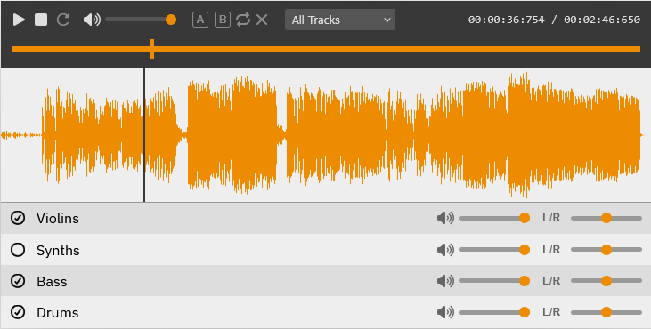

trackswitch.js
==============

[](https://audiolabs.github.io/trackswitch.js/)

trackswitch.js is a web-based multitrack audio player for presenting scientific results.

Live Demo
-------------

- See trackswitch.js in action on our demo website: https://audiolabs.github.io/trackswitch.js/

Installation
------------

Install from npm:

```bash
npm install trackswitch
```

Or download directly from Github Releases:

```text
dist/
├── css/
│   └── trackswitch.min.css
├── js/
    └── trackswitch.min.js
```

Quick Setup
-----------

### From ESM / TypeScript project

```ts
import { createTrackSwitch, type TrackSwitchInit } from 'trackswitch';
import 'trackswitch/dist/css/trackswitch.min.css';

const init: TrackSwitchInit = {
  ui: [
    {
      type: 'trackGroup',
      trackGroup: [
        {
          title: 'Track 1',
          sources: [{ src: 'track1.mp3' }],
        },
      ],
    },
  ],
};

createTrackSwitch(document.getElementById('player')!, init);
```

### From HTML

```html
<link rel="stylesheet" href="dist/css/trackswitch.min.css">
<script src="dist/js/trackswitch.min.js"></script>
<div id="player"></div>

<script>
document.addEventListener('DOMContentLoaded', function () {
  TrackSwitch.createTrackSwitch(document.getElementById('player'), {
    ui: [
      {
        type: 'trackGroup',
        trackGroup: [
          {
            title: 'Track 1',
            sources: [{ src: 'track1.mp3', type: 'audio/mpeg' }],
          },
        ],
      },
    ],
  });
});
</script>
```

Take a look into the ```examples/``` folder for a minimal working template.

Features
-----------------

### Default Mode

- Multitrack audio playback
- Play, pause, stop, seek, and repeat controls
- Global volume control
- Looping controls
- Per-track solo, volume, and pan controls
- Presets for common track combinations
- (Seekable) images and per-track images
- Interactive waveforms with zoom support
- Sheet music (musicxml) display with playback-following cursor
- Keyboard shortcuts

### Alignment mode

- Compare different performances of the same piece
- Different timelines for each track synchronized to a shared reference timeline
- Optional sync mode for mixing synchronized performances together
- Alignment warping path and tempo deviation visualizations

Programmatic API
----------------

`TrackSwitch.createTrackSwitch(rootElement, init)` returns a controller for playback, seeking, looping, presets, and track state. This means that the player can be controlled by your application, independently from the user.


Citation
--------

If you use trackswitch.js in scientific work, please cite:

Werner, Nils, et al. **"trackswitch.js: A Versatile Web-Based Audio Player for Presenting Scientific Results."** 3rd Web Audio Conference, London, UK. 2017.

```bibtex
@inproceedings{werner2017trackswitchjs,
  title={trackswitch.js: A Versatile Web-Based Audio Player for Presenting Scientific Results},
  author={Nils Werner and Stefan Balke and Fabian-Rober Stöter and Meinard Müller and Bernd Edler},
  booktitle={3rd web audio conference, London, UK},
  year={2017},
  organization={Citeseer}
}
```
